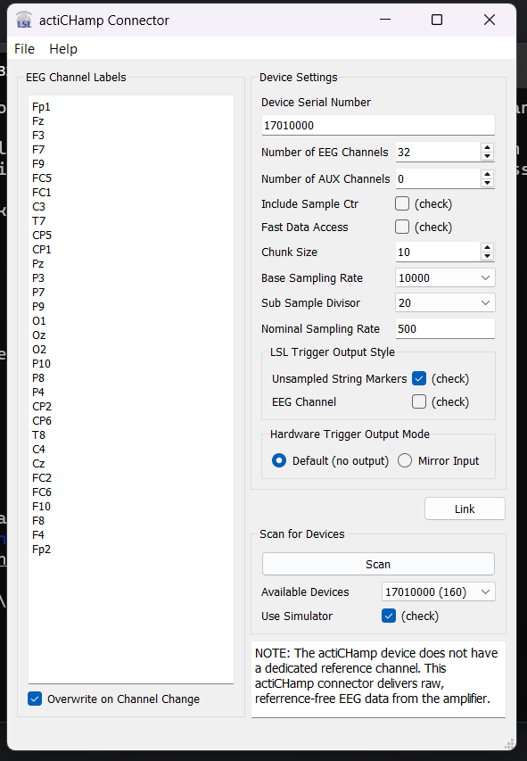
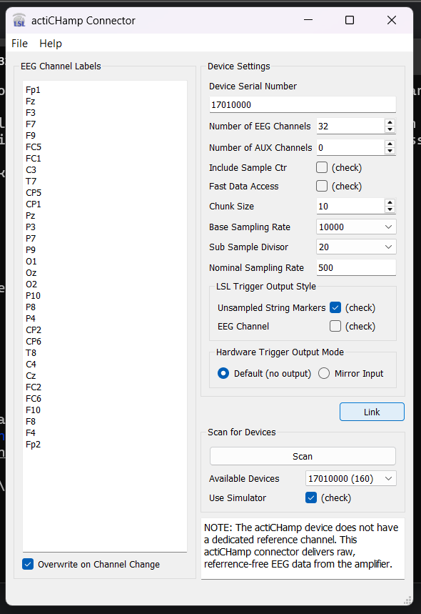

# EEG Visualizer

A real-time EEG data visualizer using Lab Streaming Layer (LSL) and simulated EEG and marker streams.

## Features
- Simulates multi-channel EEG data streams.
- Streams markers alongside EEG data.
- Visualizes real-time EEG data using Matplotlib.

## Installation

To install the project, clone this repository and install the necessary dependencies in a virtual environment:

```bash
git clone https://github.com/medro25/markers.git
python -m venv eegvenv
\eegvenv\Scripts\activate
cd markers
pip install -r requirements.txt
```
## Set Up and Getting started

To get started, install LSL_Minimal and the actiChamp Connector - https://github.com/brain-products/LSL-actiCHamp/releases

1. Start LSL_Minimal
2. Start the actiChamp connector
3. Select "Use Simulator"
4. Click "Scan" and select the device

    </img>

5. Click "Link"

     </img>

### Run the Application

To start the python app

```bash
git clone https://github.com/medro25/markers.git
python -m venv eegvenv
\eegvenv\Scripts\activate
cd markers
python app.py
```
To start the react app

```bash
cd markers/react-app
npm install
npm start
```
### Using Simulated MNE Streams

1. Run the "/data/MNE_Streams.py" script
2. Refresh the react app
3. Select the MNE Stream

